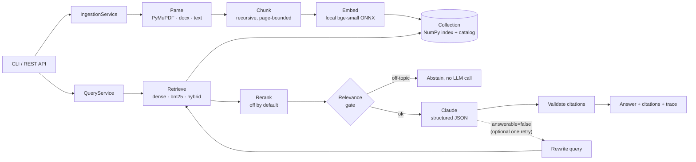

# RAG Generator

Hand it **any set of documents at runtime** (PDF, DOCX, Markdown, text) and ask
questions. Answers are grounded in those documents, with checkable citations (file,
page, passage), and the system says "not found" instead of guessing. Different
document sets live in separate **collections**, so no code changes are needed.

> Built for an agentic-coding assessment. The design reasoning is in [`docs/`](docs/),
> and the chronological record of decisions, including three defaults that
> measurement overturned, is in [`docs/DECISION_LOG.md`](docs/DECISION_LOG.md).

## Architecture



- **Two independent paths.** Ingestion writes to a per-collection index. Queries only
  read from it.
- **Every component sits behind a small protocol:** `DocumentParser`,
  `EmbeddingProvider`, `VectorStore`, `Retriever`, `Reranker` and `LLMProvider`. The
  only module that maps configuration to vendors is `orchestration/factory.py`
  ([05_API_AND_COMPONENT_DESIGN.md](docs/05_API_AND_COMPONENT_DESIGN.md)).
- **Grounding:**
  - Passages are shown to the model as `[S1]…[Sk]`.
  - The model must cite them, or return `answerable=false`.
  - Citations it wasn't given are dropped.
  - Every answer carries a `grounding_status`: `grounded`, `unverified`, `abstained`
    or `retrieval_only`.

## Tech stack

| Concern | Choice | Why (short version; details in [02](docs/02_ARCHITECTURE_DECISIONS.md) and [03](docs/03_TRADEOFF_ANALYSIS.md)) |
|---------|--------|------|
| Parsing | PyMuPDF, python-docx | Exact page numbers for citations. Pip-only install |
| Chunking | Own recursive splitter (700 / 140 characters) | Corpus-agnostic. Never crosses pages. Size chosen by measurement |
| Embeddings | fastembed `BAAI/bge-small-en-v1.5` (local ONNX) | No key, documents stay local, no PyTorch |
| Vector store | NumPy exact search, one atomic `index.npz` per collection | Zero infrastructure at this scale. pgvector or FAISS is a one-class swap |
| Retrieval | Dense (BM25 and hybrid RRF available) | Dense measured best on the sample corpus |
| Reranking | Cross-encoder available, **off** | Measured: no hit@5 gain, +1.5 s per query |
| LLM | Claude `claude-opus-5-5` at effort `low`, via the Anthropic SDK | Best cite-or-abstain discipline. Any model via `RAG_LLM_MODEL` |
| Orchestration | Plain Python | One linear pipeline plus one conditional retry. No framework needed |
| Config | pydantic-settings, `.env` | Typed, validated, nothing hard-coded |
| Interfaces | typer CLI, FastAPI (Swagger UI at `/docs`) | Evaluator-friendly with no front-end code |

## Quick start

Requires Python ≥ 3.11. Tested on 3.14 / Windows 11.

```bash
git clone <repo> && cd rag-generator
uv sync --extra dev             # or: python -m venv .venv && pip install -e ".[dev]"
source .venv/bin/activate       # Windows: .venv\Scripts\activate
cp .env.example .env            # optional: add ANTHROPIC_API_KEY for generated answers
```

The first ingest downloads the embedding model once (about 130 MB).

### 1. Ingest a document set

```bash
rag ingest data/sample/northwind -c northwind
```

```text
  [ingested] benefits_overview.md: 3 chunks
  [ingested] employee_handbook.md: 7 chunks
  [ingested] firmware_release_notes.docx: 2 chunks
  [ingested] it_security_policy.txt: 5 chunks
  [ingested] nw200_operator_manual.pdf: 7 chunks
  [ingested] warehouse_safety_procedures.md: 4 chunks
Collection 'northwind': 6 ingested, 0 failed (5.3s)
```

### 2. Ask a question

With `ANTHROPIC_API_KEY` set, you get a generated answer with citations:

```bash
rag ask "What does error E-221 mean and what should I do?" -c northwind --trace
```

The output is the answer text with inline `[S1]` markers, `status: grounded`, a
`Sources:` list (`[S1] nw200_operator_manual.pdf, p.3 — "…"`), and the trace (stage
timings, tokens, retrieved chunk IDs).

Without a key, use `--no-llm` for **retrieval-only** mode. This is real output:

```text
$ rag ask "What does error E-221 mean?" -c northwind --no-llm -k 2
status: retrieval_only

Top passages (retrieval-only mode):
  1. nw200_operator_manual.pdf, p.3 (score 0.700)
     Error codes When the status light turns amber or red, the Fleet Manager console shows an error code. ...
  2. nw200_operator_manual.pdf, p.3 (score 0.603)
     E-502 Localisation lost: the robot cannot match its position to the site map. ...

$ rag ask "How do I bake sourdough bread?" -c northwind --no-llm
status: abstained
reason: No passage was relevant enough (best similarity 0.47 < threshold 0.50).
```

### 3. A completely different document set, with no code change

```bash
rag ingest data/sample/gardening -c garden
rag ask "What can't go in the compost?" -c garden          # add --no-llm without a key
rag collections          # garden, northwind
```

### 4. The REST API

```bash
rag serve                # http://127.0.0.1:8000/docs  (upload and query from the browser)
curl -F "files=@my.pdf" -F "files=@notes.docx" localhost:8000/collections/mine/documents
curl -X POST localhost:8000/collections/mine/query -H 'content-type: application/json' \
     -d '{"question": "What is the refund policy?", "include_passages": true}'
```

Other commands: `rag docs -c NAME`, `rag delete DOC_ID -c NAME`, `rag drop -c NAME`.

## Configuration

Everything is set by environment variables or `.env` (precedence: CLI flag > env >
`.env` > default). The full list with comments is in [`.env.example`](.env.example).
The most useful ones:

| Variable | Default | Purpose |
|----------|---------|---------|
| `ANTHROPIC_API_KEY` | — | Enables generation. Without it, use `--no-llm` / `RAG_LLM_PROVIDER=none` |
| `RAG_LLM_MODEL`, `RAG_LLM_EFFORT` | `claude-opus-5-5`, `low` | e.g. `claude-sonnet-5-5` or `claude-haiku-4-5` for lower cost |
| `RAG_RETRIEVAL_MODE` | `dense` | `bm25` or `hybrid` for identifier-heavy corpora |
| `RAG_TOP_K` | `5` | Passages given to the LLM |
| `RAG_CHUNK_SIZE`, `RAG_CHUNK_OVERLAP` | `700`, `140` | Characters |
| `RAG_MIN_RELEVANCE` | `0.50` | Off-topic gate. **Recalibrate with `rag eval` if you change the embedding model** |
| `RAG_RERANKER` | `none` | `cross_encoder` enables local MiniLM reranking |
| `RAG_QUERY_REWRITE` | `false` | One bounded corrective retry when context is insufficient |
| `RAG_EMBEDDING_MODEL` | `BAAI/bge-small-en-v1.5` | Any fastembed model. Changing it requires re-ingestion (the index refuses mixed vectors) |
| `RAG_DATA_DIR` | `.rag_data` | Where collections are stored |
| `RAG_LOG_FORMAT`, `RAG_LOG_CONTENT` | `text`, `false` | Use `json` for machine logs. Document text is redacted unless `RAG_LOG_CONTENT=true` |

Invalid configuration fails at start-up with a message naming the variable.

## Testing

```bash
pytest                   # 147 tests, offline, deterministic, no key, no model download (~10 s)
pytest -m slow           # + real-model retrieval regression with bge-small
ruff check src tests scripts
```

The offline suite uses a deterministic hashing embedder and a scripted fake LLM. It
covers every failure mode in [08](docs/08_FAILURE_MODES.md): corrupt, empty, scanned
and unsupported files; duplicates; model mismatch; LLM timeouts and rate limits;
invalid citations; crash recovery; prompt-delimiter injection. See
[07_TESTING.md](docs/07_TESTING.md).

## Evaluation

```bash
rag eval data/eval/northwind_eval.jsonl -c northwind            # retrieval: dense, bm25, hybrid
rag eval data/eval/northwind_eval.jsonl -c northwind --answers --judge   # + answer quality (needs key)
python scripts/retrieval_sweep.py --rerank                      # chunk size × mode × reranker
```

The measured retrieval results (26 questions, 6 documents) for the shipped
configuration are hit@1 0.905, hit@5 1.000 and MRR 0.933. Evaluation changed three
design-time defaults:

1. **Hybrid → dense.** BM25 missed a paraphrase, and equal-weight RRF then demoted
   the correct dense hit.
2. **Chunk size 1000 → 700.**
3. **Relevance gate lowered to 0.50.** On-topic unanswerable questions score as high
   as answerable ones, so the gate can only filter off-topic questions, and the LLM
   must handle the rest.

The full analysis, and how each metric maps to an architectural fix, is in
[06_EVALUATION.md](docs/06_EVALUATION.md). *Answer-quality metrics haven't been run
yet*, because no API key was available during development. The harness is
implemented and tested.

## Documentation

| Doc | Contents |
|-----|----------|
| [00 Requirements](docs/00_REQUIREMENTS.md) | Source vs spec vs assumption vs decision; acceptance criteria |
| [01 Architecture](docs/01_ARCHITECTURE.md) | Components, flows, lifecycle, persistence, failure paths |
| [02 ADRs](docs/02_ARCHITECTURE_DECISIONS.md) | 13 decisions: context, alternatives, trade-offs, consequences |
| [03 Trade-offs](docs/03_TRADEOFF_ANALYSIS.md) | Decision matrix, and "why here / when the alternative wins" |
| [04 Plan](docs/04_IMPLEMENTATION_PLAN.md) | Phases, tasks, definition of done |
| [05 Design](docs/05_API_AND_COMPONENT_DESIGN.md) | Modules, protocols, data models, API, CLI |
| [06 Evaluation](docs/06_EVALUATION.md) · [07 Testing](docs/07_TESTING.md) · [08 Failure modes](docs/08_FAILURE_MODES.md) · [09 Security](docs/09_SECURITY_AND_PRIVACY.md) · [10 Observability](docs/10_OBSERVABILITY.md) | |
| [Decision log](docs/DECISION_LOG.md) | D1–D13, including revisions driven by measurement and by code review |

## Limitations

- No OCR: scanned PDFs are detected and rejected with a clear message. Tables are
  flattened to text.
- Single process and single user. There is no authentication, so don't expose
  `rag serve` publicly. The in-memory index suits collections up to about 10⁵ chunks.
- Single-shot Q&A: there is no conversation memory.
- Grounding is verified at the level of citation IDs at runtime. Claim-level
  faithfulness is measured offline (`--judge`), not enforced per answer.
- The evaluation set is small (26 questions): its results are directional.
- Chunk sizing uses characters as a proxy for tokens, which is less precise for
  non-English text.

## Future improvements

- Run the answer-quality evaluation against Claude and tune the prompt from the
  measured false-abstention and false-answer rates.
- BM25 stemming and weighted RRF, then re-test hybrid on an identifier-heavy corpus.
- OCR parser (Tesseract or Docling) behind the existing `DocumentParser` interface.
- A pgvector store for multi-user deployment, plus authentication and per-tenant
  collections.
- Conversation memory with follow-up question condensing.
- OpenTelemetry spans (which map one-to-one onto `StageTimer` stages) and a metrics
  endpoint.

## AI-agent transcripts

This project was built with Claude Code. The complete session transcripts are
provided separately with the submission, as the brief requires.
