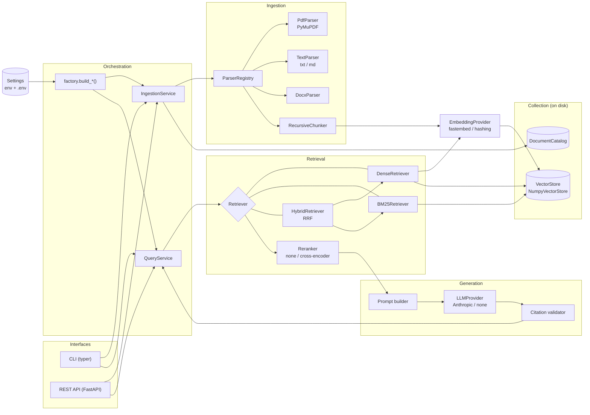
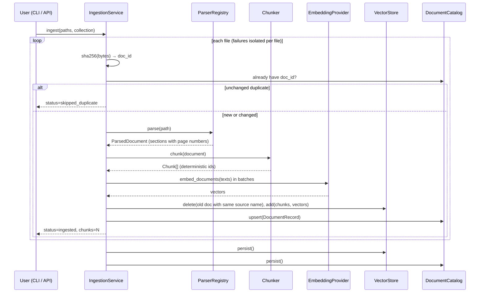
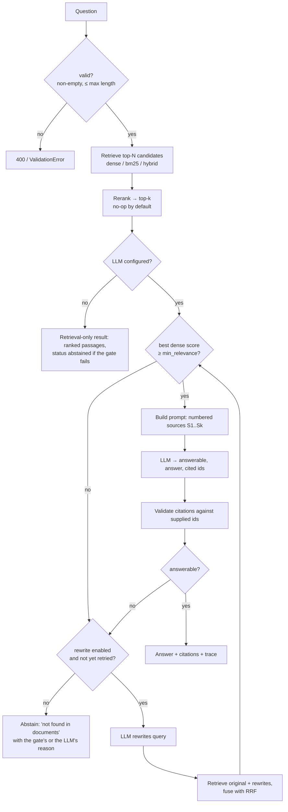
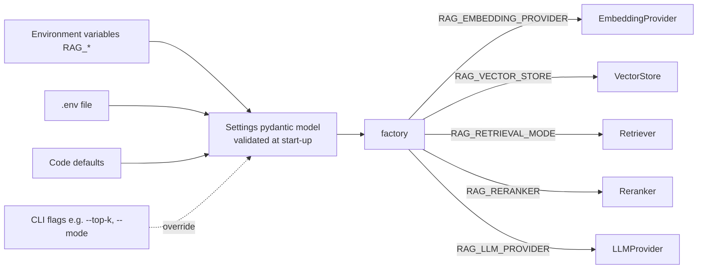

# 01 — Architecture

## 1. High-level view

The system is two independent pipelines that share one persisted **collection**:

- **Ingestion** (write path): file → parse → chunk → embed → store.
- **Query** (read path): question → retrieve → (rerank) → gate → prompt → LLM →
  validate citations → answer.

Both pipelines are assembled from small components behind interfaces by a single
**factory** that reads a typed `Settings` object. The CLI and the HTTP API are thin
adapters over two services: `IngestionService` and `QueryService`. No business logic
lives in the interfaces.



## 2. Components

| Component | Responsibility | Default implementation | Swappable via |
|-----------|----------------|------------------------|---------------|
| `Settings` | Single typed source of configuration: env vars with the `RAG_` prefix plus an optional `.env`. Validated at start-up. | `pydantic-settings` | — |
| `ParserRegistry` / `DocumentParser` | Map a file extension to a parser. Produce a `ParsedDocument` made of ordered `Section`s, each with an optional page number. Detect empty, corrupt and scanned files. | `PdfParser` (PyMuPDF), `TextParser`, `DocxParser` | Register another parser |
| `RecursiveChunker` | Split each section into overlapping chunks, preferring paragraph → line → sentence → word boundaries. Chunks never cross page boundaries, so page citations stay exact. | 700 characters, 140 overlap | `RAG_CHUNK_SIZE`, `RAG_CHUNK_OVERLAP` |
| `EmbeddingProvider` | Text → L2-normalised vectors. Separate `embed_documents` and `embed_query` methods (some models use different prefixes). | `FastEmbedProvider` (`BAAI/bge-small-en-v1.5`, local ONNX) | `RAG_EMBEDDING_PROVIDER`, `RAG_EMBEDDING_MODEL` |
| `VectorStore` | Persist chunks and vectors per collection; exact cosine search; delete by document. Records the embedding model and dimension, and refuses mismatched queries. | `NumpyVectorStore` (`.npy` + `.jsonl`) | `RAG_VECTOR_STORE` |
| `DocumentCatalog` | Per-collection registry of documents: ID, file name, content hash, chunk count, ingestion time. Drives idempotent re-ingestion and listing. | JSON file | — |
| `Retriever` | Question → ranked `RetrievedChunk`s. | `DenseRetriever` (chosen by evaluation, D8). `BM25Retriever` and `HybridRetriever` (reciprocal-rank fusion) are also available | `RAG_RETRIEVAL_MODE` = `dense` \| `bm25` \| `hybrid` |
| `Reranker` | Re-score the top-N candidates and keep the top-k. | `NoOpReranker` | `RAG_RERANKER` = `none` \| `cross_encoder` |
| Relevance gate | Abstain *before* calling the LLM when the best dense similarity is below a threshold. This only catches off-topic questions (D9). | 0.50 for bge-small | `RAG_MIN_RELEVANCE` |
| Prompt builder | Render retrieved chunks as numbered sources `[S1]…[Sn]` with file and page, inside a context budget. Documents are delimited as untrusted data. | — | `RAG_MAX_CONTEXT_CHARS` |
| `LLMProvider` | (system, user, schema) → structured JSON plus usage. | `AnthropicProvider` (Claude) | `RAG_LLM_PROVIDER` = `anthropic` \| `none` |
| Citation validator | Keep only citations whose IDs were actually supplied as context; derive `grounding_status`. | — | — |
| `QueryService` | Run the query flow, including the optional corrective retry, and build a `QueryTrace`. | — | `RAG_QUERY_REWRITE` |
| `IngestionService` | Run the ingestion flow per file, isolating failures and producing an `IngestReport`. | — | — |
| Evaluation runner | Run a labelled dataset through retrieval and, optionally, generation, and compute metrics. | `rag eval` | — |

## 3. Ingestion flow



Key properties:

- **Document identity = content hash.** Re-uploading identical bytes (even under a
  different name) is a no-op. Uploading different bytes under an existing file name
  replaces the previous version, so the index never holds two versions of the same
  file. The new version is added *before* the old one is removed, so a failed replace
  (for example an embedding-model mismatch) leaves the old version intact.
- **Source names** are paths relative to the common parent of the ingested inputs:
  `rag ingest a b` yields `a/notes.md` and `b/notes.md`, not two colliding
  `notes.md`s. Two files with the same name in one upload batch are rejected
  (`DuplicateSourceError`).
- **Deterministic chunk IDs** (`{doc_id[:12]}-{index:05d}`), so citations, logs and
  evaluation labels stay stable across runs.
- **Per-file isolation.** A corrupt file yields `status=failed` with a reason, and the
  rest of the batch continues. Unexpected library exceptions are caught per file too.
- **Persist only if something changed** (the store's version moved).
- **Persist once per batch**, after all files, using an atomic write-and-rename
  (§7).

## 4. Query flow



Both "insufficient context" signals lead into the same branch: the relevance gate
failing, or the LLM returning `answerable=false`. With rewriting off (the default), the
branch abstains. If the gate fails, no LLM call is made at all.

The corrective branch (`RAG_QUERY_REWRITE=true`) is the only agentic behaviour in
the system. It is bounded to **one** retry: after the rewrite, a failed gate or a
second `answerable=false` abstains. The retry is optional work, so if the rewrite
call itself fails (rate limit, timeout) the first-round abstention is returned and
the error is recorded in `trace.rewrite_error`. An empty rewrite skips the retry. The gate triggers the rewrite too, because
vocabulary mismatch often shows up as low similarity. The rationale is in ADR-009.

## 5. Runtime document lifecycle

| Stage | Trigger | Effect |
|-------|---------|--------|
| Upload / ingest | `rag ingest <paths> -c <collection>` or `POST /collections/{c}/documents` | File is parsed from memory (parsers take bytes, D7), then chunked, embedded and persisted. The application writes no temporary files; note that the web framework (Starlette) spools multipart parts larger than 1 MB to its own temporary files while receiving them. |
| Re-ingest same content | Same commands | Skipped (`skipped_duplicate`). |
| Re-ingest changed file with the same name | Same commands | Old chunks for that file name are removed, and the new version is indexed. |
| List | `rag docs -c <c>` / `GET /collections/{c}/documents` | Reads the catalog. |
| Delete | `rag delete <doc_id> -c <c>` / `DELETE /collections/{c}/documents/{doc_id}` | Removes the document's chunks and vectors and its catalog entry. |
| Drop collection | `rag drop -c <c>` / `DELETE /collections/{c}` | Waits for in-flight writes, marks the handle closed (later writes are refused), then removes the directory. |
| Query | `rag ask` / `POST /collections/{c}/query` | Read-only against the current snapshot. |

A collection is created lazily on first ingest. Querying a missing collection
returns `CollectionNotFoundError` (HTTP 404), and querying an empty one returns
`CollectionEmptyError` (HTTP 409), rather than an empty answer.

## 6. Configuration flow



Precedence is CLI flag > environment variable > `.env` > default. Invalid values
(for example `chunk_overlap >= chunk_size`, or an unknown provider) fail at start-up
with a message naming the variable. The factory is the **only** module that imports
concrete vendor classes. Everything else depends on the protocols in each package's
`base.py`.

## 7. Persistence layout

```
${RAG_DATA_DIR}/                 (default ./.rag_data)
└── collections/
    └── <collection>/
        ├── index.npz            one file: vectors float32 [n, dim] + chunks (JSON) + manifest
        │                        (embedding model id, dimension, schema version)
        └── documents.json       DocumentCatalog
```

Vectors and chunks live in **one** file so they can never be written out of step.
Each file is written to a temporary name, then renamed with `os.replace`, which is
atomic on the same filesystem. The index is written before the catalog, so a crash
between the two can leave them out of step in either direction. On open, the
collection is reconciled both ways: chunks with no catalog entry (crash during an
add) are dropped, and catalog entries with no chunks (crash during a delete or
replace) are removed. Either way, re-ingesting the file restores it.
The BM25 index is **derived** state: it is rebuilt in memory from the stored chunks
whenever the store's version changes, and never persisted.

## 8. Failure paths (summary)

Full detail is in [08_FAILURE_MODES.md](08_FAILURE_MODES.md).

| Where | Failure | Behaviour |
|-------|---------|-----------|
| Start-up | Invalid config | Exit with a message naming the bad variable. |
| Ingest | Unsupported, empty, corrupt or scanned file | That file is reported as `failed` / `skipped` with a reason; the batch continues. |
| Ingest | Embedding model fails to load or download | Typed `EmbeddingError`; nothing is persisted for the batch. |
| Query | Collection missing or empty | `CollectionNotFound` / `CollectionEmpty` error (HTTP 404 / 409). |
| Query | Embedding model differs from the one the index was built with | `IndexMismatchError` telling you to re-ingest. |
| Query | Low relevance | Abstain without calling the LLM. |
| Query | LLM timeout, rate limit or 5xx | SDK retries with backoff (bounded); then `GenerationError` (HTTP 503). The trace records the failure. |
| Query | LLM refusal or malformed output | `GenerationError` with the reason; never shown to the user as an answer. |
| Query | LLM cites IDs it wasn't given | Invalid citations are dropped. If none remain, `grounding_status = "unverified"` and a warning is logged. |
