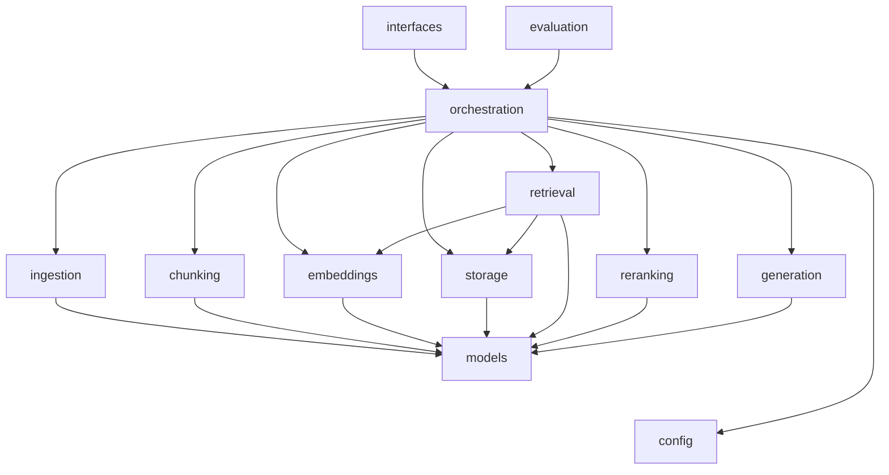

# 05 — API and Component Design

## 1. Package layout and dependency direction

```
src/rag_generator/
├── config/          Settings (pydantic-settings). Reads the environment; nothing else does.
├── models/          Pydantic data models shared by every layer (no logic, no I/O).
├── errors.py        Error hierarchy rooted at RAGError.
├── observability/   JSON/text logging, content redaction, StageTimer.
├── textproc.py      Tokeniser shared by BM25 and the hashing embedder.
├── ingestion/       DocumentParser protocol, PdfParser/TextParser/DocxParser, ParserRegistry.
├── chunking/        RecursiveChunker.
├── embeddings/      EmbeddingProvider protocol, FastEmbedProvider, HashingEmbeddingProvider.
├── storage/         VectorStore protocol, NumpyVectorStore, DocumentCatalog, Collection(+Repository).
├── retrieval/       Retriever protocol, BM25Index, Dense/BM25/Hybrid retrievers, RRF.
├── reranking/       Reranker protocol, NoOpReranker, CrossEncoderReranker.
├── generation/      LLMProvider protocol, prompts + schemas, citation validation, AnthropicProvider.
├── orchestration/   IngestionService, QueryService, factory (composition root), RAGApplication.
├── evaluation/      Dataset schema, pure metrics, EvaluationRunner.
├── interfaces/      cli.py (typer), api.py (FastAPI): thin adapters.
└── ui/              Streamlit app: HTTP client, formatting helpers, views (API client only).
```

Dependencies point downwards only:



**Vendor boundary.** `anthropic` is imported only in
`generation/anthropic_provider.py`, and `openai` only in the two `openai_provider.py`
modules (loaded lazily by the factory). `fastembed` is imported only inside
`FastEmbedProvider._load` and `CrossEncoderReranker._load`, lazily, so importing the
package never loads a model. `pymupdf` and `docx` are imported only inside their
parser methods. The factory is the single place that maps configuration to concrete
classes.

## 2. Interfaces (protocols)

All interfaces are `typing.Protocol`s (structural typing), so an implementation needs
no base class. Tests use plain fakes that satisfy the same shape.

| Protocol | Methods | Implementations | Contract |
|----------|---------|-----------------|----------|
| `DocumentParser` | `extensions: tuple[str, ...]`, `parse(data: bytes, source: str) -> ParsedDocument` | `PdfParser`, `TextParser`, `DocxParser` | Never returns a document with no text. Raises an `IngestionError` subclass for unusable input. |
| `EmbeddingProvider` | `model_id`, `embed_documents(list[str]) -> ndarray[n, d]`, `embed_query(str) -> ndarray[d]` | `FastEmbedProvider`, `OpenAIEmbeddingProvider`, `HashingEmbeddingProvider` | Vectors are L2-normalised `float32`. `model_id` uniquely identifies the vector space. |
| `VectorStore` | `version`, `model_id`, `__len__`, `add`, `delete_document`, `drop_orphans`, `search(vec, k) -> [(Chunk, score)]`, `all_chunks`, `persist` | `NumpyVectorStore` | `search` returns cosine-descending results. The store refuses vectors or queries from a different `model_id` (`IndexMismatchError`). `version` increases on every mutation. |
| `Retriever` | `name`, `retrieve(query, k) -> RetrievalResult` | `DenseRetriever`, `BM25Retriever`, `HybridRetriever` | `RetrievalResult.best_dense_score` is `None` when the mode has no dense component. |
| `Reranker` | `name`, `rerank(query, candidates, k) -> list[RetrievedChunk]` | `NoOpReranker`, `CrossEncoderReranker` | Returns at most `k` items, highest first. |
| `LLMProvider` | `model_id`, `generate_json(system, user, schema) -> LLMResponse` | `AnthropicProvider`, `OpenAIProvider` (tests: `FakeLLM`) | Returns a JSON object matching `schema`, or raises `GenerationError(retryable=…)`. Knows nothing about RAG. |

### Adding a new implementation (examples)

| Change | Work required |
|--------|---------------|
| pgvector store | Class `PgVectorStore` implementing `VectorStore`, plus one branch in `factory.build_repository`, plus `"pgvector"` in `Settings.vector_store`. |
| OpenAI embeddings / LLM | **Done** this way (ADR-014): `OpenAIEmbeddingProvider` and `OpenAIProvider`, plus one branch each in `build_embedder` and `build_llm`. |
| Voyage / Cohere embeddings | Class implementing `EmbeddingProvider`, plus one branch in `factory.build_embedder`. Existing collections will raise `IndexMismatchError` until they are re-ingested. |
| Different LLM vendor or local model | Class implementing `LLMProvider.generate_json`, plus one branch in `factory.build_llm`. Prompts, schema and citation logic are reused unchanged. |
| HTML parser | Class with `extensions = ("html",)`, registered in `ParserRegistry`. |

## 3. Services

### `IngestionService` (write path)

```python
ingest_paths(paths: Iterable[Path], collection: str) -> IngestReport
ingest_bytes(files: list[tuple[str, bytes]], collection: str) -> IngestReport
delete_document(collection: str, doc_id: str) -> DocumentRecord | None
```

- The service holds the collection's write lock for the whole batch, and persists once
  at the end if anything changed.
- `doc_id` is the first 16 hex characters of SHA-256(bytes). Identical content is
  skipped. Different content under an existing `source` name replaces it.
- Per-file failures become `IngestResult(status="failed", error_type, message)`. They
  never raise out of the batch.

### `QueryService` (read path)

```python
ask(question: str) -> Answer
```

The service is constructed per request by `RAGApplication.query(collection, mode=,
top_k=, use_llm=)`. It takes a `QueryOptions` dataclass (top_k, candidate_pool,
min_relevance, max_context_chars, max_question_chars, query_rewrite, max_rewrites,
rrf_k), not the whole `Settings`, so tests can construct it directly.

### `RAGApplication` (composition root)

This object is long-lived and holds the components that are expensive to create:
the embedding model, reranker, LLM client, collection repository, parser registry and
chunker. The CLI creates one per command. The API creates one per process and shares
it across requests.

## 4. Data models (`models/`)

| Model | Key fields | Notes |
|-------|------------|-------|
| `Section` | `text`, `page: int \| None` | One PDF page, or the whole text of a pageless format. |
| `ParsedDocument` | `source`, `file_type`, `sections`, `warnings` | Parser output. |
| `Chunk` | `chunk_id`, `doc_id`, `source`, `page`, `index`, `text` | `chunk_id = f"{doc_id[:12]}-{index:05d}"` (deterministic). |
| `DocumentRecord` | `doc_id`, `source`, `file_type`, `content_hash`, `size_bytes`, `num_chunks`, `num_pages`, `ingested_at` | Catalog entry. |
| `IngestResult` / `IngestReport` | `status ∈ {ingested, replaced, skipped_duplicate, failed}`, `error_type`, `message`, `warnings` | Per-file outcome. |
| `RetrievedChunk` | `chunk`, `score`, `dense_score`, `lexical_score`, `rerank_score` | Component scores are kept for tracing. |
| `Citation` | `source_id` (`S1`…), `chunk_id`, `doc_id`, `source`, `page`, `snippet` | Resolved from validated IDs. |
| `QueryTrace` | mode, reranker, model, attempts, rewritten queries, retrieved chunk IDs, best dense score, gate threshold, invalid citations, tokens, stage timings | Contains **no document text**. |
| `Answer` | `answer`, `answerable`, `grounding_status ∈ {grounded, unverified, abstained, retrieval_only}`, `citations`, `reason`, `passages`, `trace` | API and CLI response. |

## 5. Configuration model

`Settings` (`config/settings.py`) is a flat pydantic model. Each field's env var is
`RAG_<FIELD_NAME>`, except `ANTHROPIC_API_KEY`. The full list with defaults and
comments is in [`.env.example`](../.env.example). The groups are:

- **Storage:** `data_dir`, `default_collection`, `max_file_mb`, `max_upload_files`.
- **Chunking:** `chunk_size`, `chunk_overlap`, `min_chunk_chars`.
- **Embeddings:** `embedding_provider` (`fastembed` | `openai` | `hashing`), `embedding_model` (default per provider), `embedding_batch_size`,
  `hashing_dimensions`, `model_cache_dir`.
- **Retrieval:** `retrieval_mode`, `top_k`, `candidate_pool`, `rrf_k`, `min_relevance`.
- **Reranking:** `reranker`, `reranker_model`.
- **Generation:** `llm_provider` (`anthropic` | `openai` | `none`), `llm_model` (default per provider), `llm_effort` (Anthropic), `llm_max_tokens`,
  `llm_timeout_s`, `llm_max_retries`, `llm_temperature`, `anthropic_server_fallback`,
  `max_context_chars`, `max_question_chars`.
- **OpenAI:** `openai_api_key` (`OPENAI_API_KEY`), `openai_base_url`, `openai_reasoning_effort`.
- **Agentic:** `query_rewrite`, `max_rewrites`.
- **Observability:** `log_level`, `log_format`, `log_content`.

Provider-dependent defaults (`llm_model`, `embedding_model`, `min_relevance`) are resolved
once in a validator, so all readers see concrete values. `min_relevance` resolves to
0.50 only for the calibrated bge-small model, and to 0 (gate off, with a start-up
warning) otherwise.

Validation: enum-like fields are `Literal`s, and numeric fields have bounds. Two
cross-field rules exist: `chunk_overlap < chunk_size` and `top_k <= candidate_pool`.
The collection name pattern `^[A-Za-z0-9_-]{1,64}$` also prevents path traversal.

## 6. REST API

The API runs with `rag serve`. Interactive documentation is at `http://127.0.0.1:8000/docs`.

| Method & path | Body | Response | Errors |
|---------------|------|----------|--------|
| `GET /health` | — | status, versions, models, mode | — |
| `GET /collections` | — | `list[str]` | — |
| `POST /collections/{c}/documents` | multipart `files[]` | `IngestReport` (per-file statuses) | 400 invalid collection name · 413 more than `RAG_MAX_UPLOAD_FILES` files |
| `GET /collections/{c}/documents` | — | `list[DocumentRecord]` | 404 |
| `DELETE /collections/{c}/documents/{doc_id}` | — | `DocumentRecord` | 404 |
| `DELETE /collections/{c}` | — | 204 | 404 |
| `GET /config` | — | supported extensions, limits, active LLM and embedding models, whether client keys are accepted, default model per provider, retrieval modes, rerankers, defaults (no secrets) | — |
| `POST /llm/verify` | optional `X-LLM-*` headers | `{ok, provider, model, detail?}`, from one tiny LLM call | 400 bad headers · 403 client keys disabled |
| `POST /collections/{c}/evaluate` | multipart `dataset` (JSONL) + form `modes`, `rerankers`, `answers`, `judge` | evaluation report (same shape as `rag eval`; undefined metrics are `null`) | 400 bad dataset, unknown mode, or answers without an LLM · 404 · 413 |
| `POST /collections/{c}/query` | `{question, top_k?, mode?, retrieval_only?, rewrite?, include_passages?}` | `Answer` | 400 invalid question · 404 no collection · 409 empty collection or index mismatch · 422 schema · 503 LLM failure (`retryable` flag) |

**Caller-supplied keys.** `/query`, `/evaluate` and `/llm/verify` accept
`X-LLM-API-Key`, optional `X-LLM-Provider` (`auto` \| `anthropic` \| `openai`;
`auto` detects the provider from the key: `sk-ant-…` is Anthropic, any other `sk-…` is
OpenAI) and optional `X-LLM-Model`. The API builds a provider for that request via
`RAGApplication.llm_for()`, which is LRU-cached by (provider, SHA-256 of the key, model).
Without these headers the server's own LLM is used. `RAG_ALLOW_CLIENT_LLM_KEYS=false`
rejects them with 403.

Error bodies have the shape `{"error": "<ErrorClass>", "detail": "<message>"}`. The
mapping lives in one table (`interfaces/api.py::_STATUS_BY_ERROR`).

Example:

```bash
curl -F "files=@handbook.pdf" -F "files=@policy.docx" localhost:8000/collections/hr/documents
curl -X POST localhost:8000/collections/hr/query -H 'content-type: application/json' \
     -d '{"question": "How many days of annual leave do I get?"}'
```

## 7. Web UI (`rag_generator/ui/`)

| Module | Responsibility |
|--------|----------------|
| `client.py` | `RAGClient`: typed HTTP client for every endpoint. It URL-encodes path segments, and turns error bodies into `APIError(message, status, error, retryable)`. An unreachable server gets a "start `rag serve`" hint. |
| `formatting.py` | Pure helpers with no Streamlit import: status badges, `[S#]` → citation chips, escaping document text so Markdown and LaTeX in it render literally, and table rows for passages, ingest results, documents and metrics. |
| `views.py` | **Ask** (chat with per-collection history; query options for mode, top-k, retrieval-only and corrective rewrite; answer with status badge, citation cards, passages table and trace), **Documents** (upload with types and limits from `/config`, ingest report, document table, delete, drop with confirmation), **Evaluate** (upload JSONL, pick modes and rerankers, metrics, best configuration, gate calibration, per-category table, JSON download), **System** (active models and defaults). |
| `app.py` | Entry point: sidebar (API URL, connection status, collection picker and new-collection name validation) and tabs. |

Dependency rule: `ui/` imports only `ui/`, `streamlit` and `httpx`, never the backend
packages. Everything the UI knows about the server comes from `/config`.

## 8. CLI

| Command | Purpose |
|---------|---------|
| `rag ingest PATH... [-c NAME]` | Ingest files and directories (recursive, supported types only). |
| `rag ask "QUESTION" [-c NAME] [--mode] [-k N] [--no-llm] [--rewrite] [--trace] [--json]` | Ask a question. |
| `rag docs [-c NAME]` / `rag collections` | List documents or collections. |
| `rag delete DOC_ID [-c NAME]` / `rag drop [-c NAME] [--yes]` | Remove a document or a whole collection. |
| `rag eval DATASET [-c NAME] [--modes dense,bm25,hybrid] [--rerankers none,cross_encoder] [--answers] [--judge]` | Evaluate. Writes a JSON report to `eval_reports/`. |
| `rag serve [--host] [--port]` | Start the REST API. |
| `rag ui [--api-url] [--port] [--host] [--with-api]` | Start the Streamlit UI (requires the `ui` extra). `--with-api` also starts `rag serve`. |

Exit codes: `0` for success, `1` for an application error (the message goes to
stderr), and `2` for invalid configuration.
